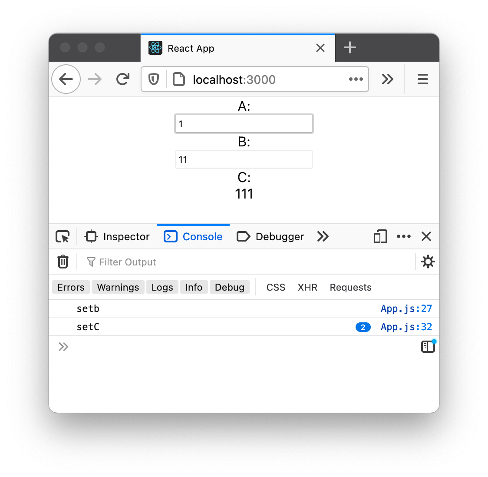

# Hook Navigator

_Untangle the web of state setters in React.js_

If you've developed in React, you've probably spent time investigating multiple re-renders. This tool analyzes your React component and identifies state variables that trigger multiple setter calls for other state variables.

## Example

Suppose you have a React comonent:

```
...

const [a, setA] = useState("");
const [b, setB] = useState("");
const [c, setC] = useState("");

useEffect(() => {
  setB(a + a);
}, [a]);

useEffect(() => {
  setC(a + b);
}, [a, b]);

...
```

A change in `a` will trigger `b` to change, and a change in `a` or `b` will trigger `c` to change. So when `a` changes, `setC` will be called twice:



Schematically, we have the following "call paths" between setters:

<pre>
 setA
  |  \
  |   \
  |    \
  |     \
  |      \
  |       \
  |        |
  V        V
setB ---> setC
</pre>

Running this tool on this example outputs:

<pre>
Analyzing  ./example/ExampleComponent.js :


These state variable trigger ONE setter for these state variables:
        - Setting a triggers setting b via the chain [ 'a', 'b' ]
        - Setting b triggers setting c via the chain [ 'b', 'c' ]

Good job :)


These state variable trigger MULTIPLE setters for these state variables:
        - Setting a triggers setting c via the chains:
                -  [ 'a', 'b', 'c' ]
                -  [ 'a', 'c' ]

Please address these.
</pre>

## Node versions

Works in Node 14.

## Install

Install dependencies with `npm install`

## Test

Tests use jest. Run `npm test`.

## To use

1. install globally using `npm i -g`
2. or don't

If you install globally, run with `hook-navigator --files {list of react components you want to test separated by spaces}`

If you don't install globally, run with `node index.js --files {list of react components you want to test separated by spaces}`
